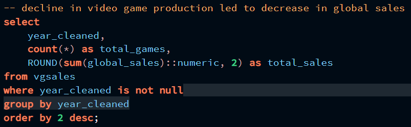
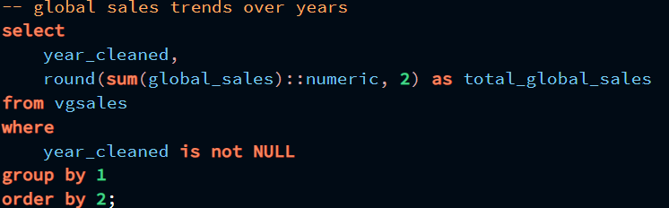
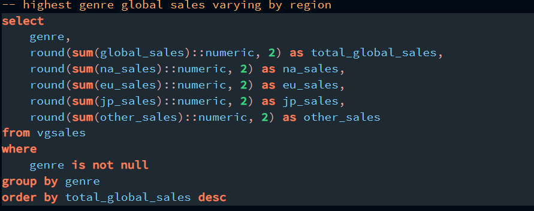
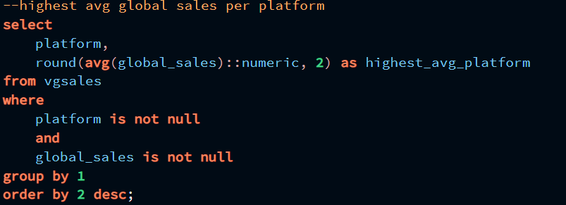
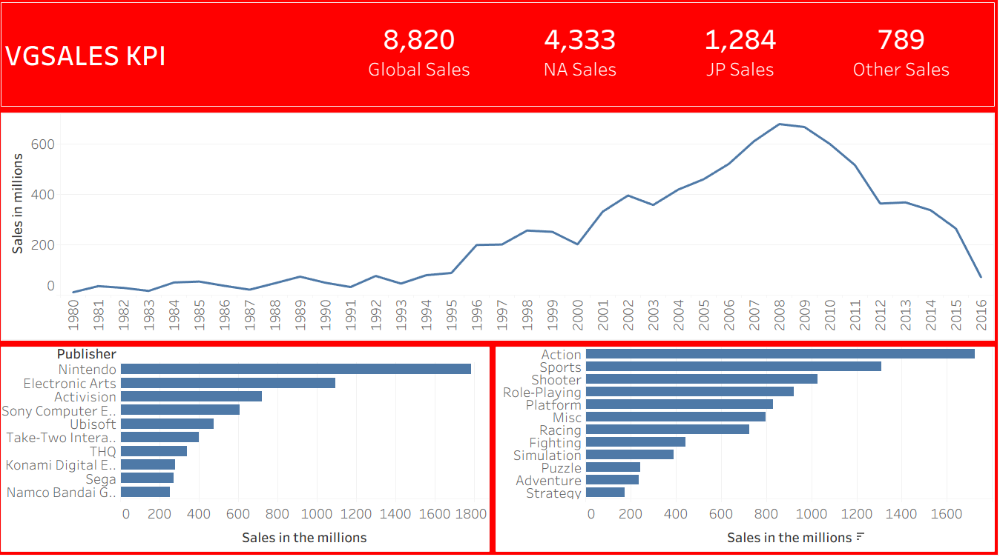

# vgsales_kpi
Analytics project

This project analyzes global video game sales data to uncover key performance insights across platforms,
publishers, regions, and game genres. Using Excel, SQL, and Tableau, the dataset was cleaned,
explored, and visualized to identify industry trends and answer critical business questions

---

##  Table of Contents
- [Project Background](#project-background)
- [Tools Used](#tools-used)
- [Data Cleaning & Preparation](#data-cleaning--preparation)
- [Exploratory Data Analysis](#exploratory-data-analysis)
- [Key Insights](#key-insights)
- [Recommendations](#recommendations)
- [Files Included](#files-included)
- [Dataset Source](#dataset-source)
- [Gallary](#gallary)  including queires used and dashboard preview

---

##  Project Background

This project explores a dataset containing global video game sales from 1980 to 2016.
The goal is to uncover trends and key performance indicators (KPIs) that highlight the industry's evolution over time. 
Using Excel for initial cleaning, SQL for data analysis, and Tableau for data visualization,
this project delivers actionable insights into game sales across different platforms, publishers, regions, and genres.

---

##  Tools Used

- **SQL** – Data extraction, cleaning, joins, and aggregation
- **Excel** – Additional data validation and export
- **Tableau** – Interactive visual dashboards

---

##  Data Cleaning & Preparation

- Used `CTE` and `UNION ALL` operations in SQL to seprate and evaluate sales based on region
- Removed null values and standardized categorical variables
- Used `Window Functions` to aggregate and filter data

---

##  Exploratory Data Analysis

- Removed rows with missing values in key columns such as Name, Platform, Year, and Genre.

- Standardized column names and formatted data types.

- Analyzed if production correlated to global sales.
  

---

##  Key Insights

- **Global sales trend over the years**:  
  Global sales have **dropped 90% from 678 to 70m** from the year **2008 to 2016**

- **Top-performing publishers by global sales**:  
  **Nintendo** leads global sales with **1.7B**

- **Platform with highest average sales per game**:  
  **Gameboy** averaged **2.6M** per game.

- **Regional best selling genre**:  
  **Action** leads sales in NA, EU, and other, while **Roleplaying** leads sales in JP.
---

##  Recommendations

- Focus marketing campaigns on customers aged **30–39** and married for higher conversion potential.
- Prioritize **cellular contact methods** over telephone or unknown methods.
- Increase campaign activity in **Q2**, especially **May**, based on past success.

---

##  Files Included

- `vgsales.sql` – Creates CTE's to view regional best selling games, and data manipulation to ensure accuracy
- `vgsales.twbx` – Tableau workbook with key insights and visualizations
- `vgsales.xlsx` – Cleaned dataset in Excel format

---
## Dataset Source

-[https://www.kaggle.com/datasets/gregorut/videogamesales.](URL)

---

## Gallary
- Queries used in postgres

  

  

  

  

- Dashboard Preview

